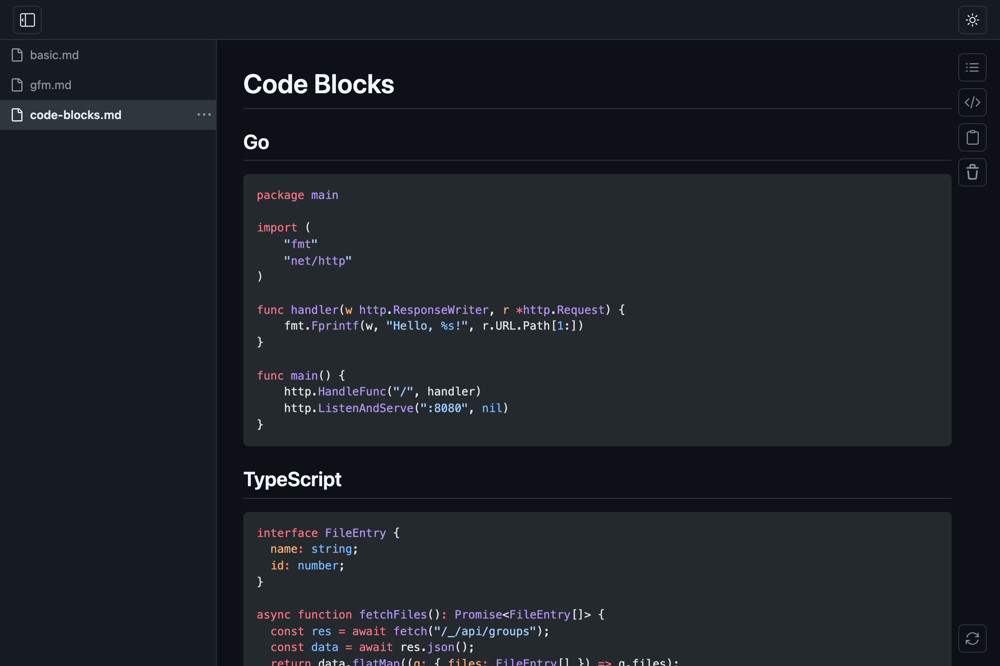
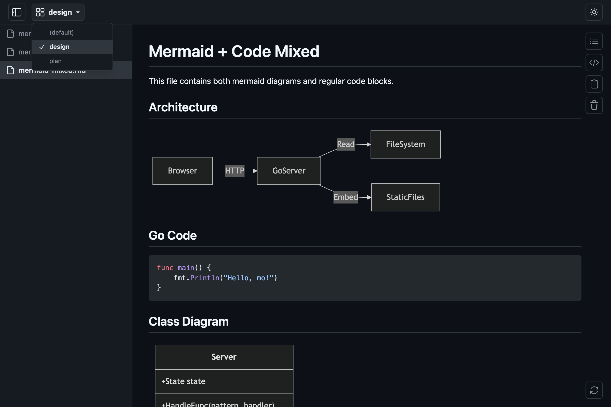

<p align="center">
<br><br><br>

<br><br><br>
</p>

# mo

[](https://github.com/k1LoW/mo/actions/workflows/ci.yml)   

`mo` is a **M**arkdown viewer that **o**pens `.md` files in a browser.

## Features

- GitHub-flavored Markdown (tables, task lists, footnotes, etc.)
- Syntax highlighting ([Shiki](https://shiki.style/))
- [Mermaid](https://mermaid.js.org/) diagram rendering
-  Dark /  light theme
-  File grouping
-  Table of contents panel
-  Flat /  tree sidebar view with drag-and-drop reorder
- YAML frontmatter display (collapsible metadata block)
- MDX file support (renders as Markdown, strips `import`/`export`, escapes JSX tags)
-  Raw markdown view
-  Copy content (Markdown / Text / HTML)
-  Server restart with session preservation
- Live-reload on save

## Install

**homebrew tap:**

```console
$ brew install k1LoW/tap/mo
```

**manually:**

Download binary from [releases page](https://github.com/k1LoW/mo/releases)

## Usage

``` console
$ mo README.md                          # Open a single file
$ mo README.md CHANGELOG.md docs/*.md   # Open multiple files
$ mo spec.md --target design            # Open in a named group
```

`mo` opens Markdown files in a browser with live-reload. When you save a file, the browser automatically reflects the changes.

### Single server, multiple files

By default, `mo` runs a single server on port `6275`. If a server is already running on the same port, subsequent `mo` invocations add files to the existing session instead of starting a new one.

``` console
$ mo README.md          # Starts a mo server in the background
$ mo CHANGELOG.md       # Adds the file to the running mo server
```

To run a completely separate session, use a different port:

``` console
$ mo draft.md -p 6276
```



### Groups

Files can be organized into named groups using the `--target` (`-t`) flag. Each group gets its own URL path and sidebar.

``` console
$ mo spec.md --target design      # Opens at http://localhost:6275/design
$ mo api.md --target design       # Adds to the "design" group
$ mo notes.md --target notes      # Opens at http://localhost:6275/notes
```



### Glob pattern watching

Use `--watch` (`-w`) to specify glob patterns. Matching files are opened automatically, and watched directories are monitored for new files.

``` console
$ mo --watch '**/*.md'                          # Watch and open all .md files recursively
$ mo --watch 'docs/**/*.md' --target docs       # Watch docs/ tree in "docs" group
$ mo --watch '*.md' --watch 'docs/**/*.md'      # Multiple patterns
```

`--watch` cannot be combined with file arguments. The `**` pattern matches directories recursively.

### Sidebar view modes

The sidebar supports flat and tree view modes. Flat view shows file names only, while tree view displays the directory hierarchy.

| Flat | Tree |
|------|------|
|  |  |

### Starting and stopping

`mo` runs in the background by default — the command returns immediately, leaving the shell free for other work. This makes it easy to incorporate into scripts, tool chains, or LLM-driven workflows.

``` console
$ mo README.md
mo: serving at http://localhost:6275 (pid 12345)
$ # shell is available immediately
```

Use `--status` to check all running mo servers, and `--shutdown` to stop one:

``` console
$ mo --status              # Show all running mo servers
$ mo --shutdown            # Shut down the mo server on the default port
$ mo --shutdown -p 6276    # Shut down the mo server on a specific port
```

If you need the mo server to run in the foreground (e.g. for debugging), use `--foreground`:

``` console
$ mo --foreground README.md
```

### Server restart

Click the  restart button (bottom-right corner) to restart the `mo` server process. The current session — all open files and groups — is preserved across the restart. This is useful when you have updated the `mo` binary and want to pick up the new version without re-opening your files.

### Flags

| Flag | Short | Default | Description |
|------|-------|---------|-------------|
| `--target` | `-t` | `default` | Group name |
| `--port` | `-p` | `6275` | Server port |
| `--open` | | | Always open browser |
| `--no-open` | | | Never open browser |
| `--status` | | | Show all running mo servers |
| `--watch` | `-w` | | Glob pattern to watch for matching files (repeatable) |
| `--shutdown` | | | Shut down the running mo server |
| `--foreground` | | | Run mo server in foreground |

## Build

Requires Go and [pnpm](https://pnpm.io/).

``` console
$ make build
```

## References

- [yusukebe/gh-markdown-preview](https://github.com/yusukebe/gh-markdown-preview): GitHub CLI extension to preview Markdown looks like GitHub.
