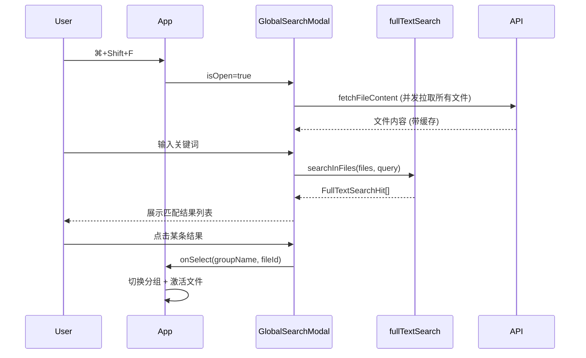

# 全局全文搜索

## 功能概述

通过快捷键呼出搜索弹窗，对所有已加载文件的内容进行全文检索，点击结果可直接跳转到对应文件。

## 使用方式

| 操作               | 快捷键 / 交互                                                 |
| ------------------ | ------------------------------------------------------------- |
| 打开搜索           | `⌘ + Shift + F`（macOS）/ `Ctrl + Shift + F`（Windows/Linux） |
| 关闭搜索           | `Escape` 或点击弹窗外区域                                     |
| 快速打开第一条结果 | `Enter`                                                       |
| 跳转到指定结果     | 点击结果条目                                                  |

## 搜索行为

- 搜索范围：所有分组（group）下的所有文件内容
- 匹配方式：大小写不敏感的子串匹配
- 结果上限：默认最多 200 条命中
- 结果信息：文件名、所属分组、行号、命中片段（关键词高亮）

## 实现架构

## 涉及文件

| 文件                                   | 职责                                             |
| -------------------------------------- | ------------------------------------------------ |
| `src/App.tsx`                          | 快捷键监听、弹窗状态管理、结果跳转               |
| `src/components/GlobalSearchModal.tsx` | 搜索弹窗 UI、文件内容加载与缓存、结果渲染        |
| `src/utils/fullTextSearch.ts`          | 全文检索核心算法（按行匹配、预览截取、高亮位置） |
| `src/utils/fullTextSearch.test.ts`     | 检索逻辑单元测试                                 |

## 待优化项

### 交互体验

1. **键盘导航** — 上下方向键选择结果、Enter 打开选中项，减少鼠标依赖
2. **防抖输入** — 文件较多时加 ~150ms debounce，避免每次按键都触发搜索
3. **每行多处匹配** — 当前每行只取第一个命中，长行中后续匹配会被遗漏

### 性能

4. **增量缓存** — 当前每次打开弹窗都重新拉取所有文件内容；可改为只拉新增/变更文件（结合 SSE `file-changed` 事件清除对应缓存）
5. **Web Worker 搜索** — 文件数量很大时搜索会阻塞主线程，可移至 Worker 执行

### 功能增强

6. **正则搜索** — 支持切换为正则表达式匹配模式
7. **结果按文件分组折叠** — 同一文件多处命中时折叠展示，界面更紧凑
